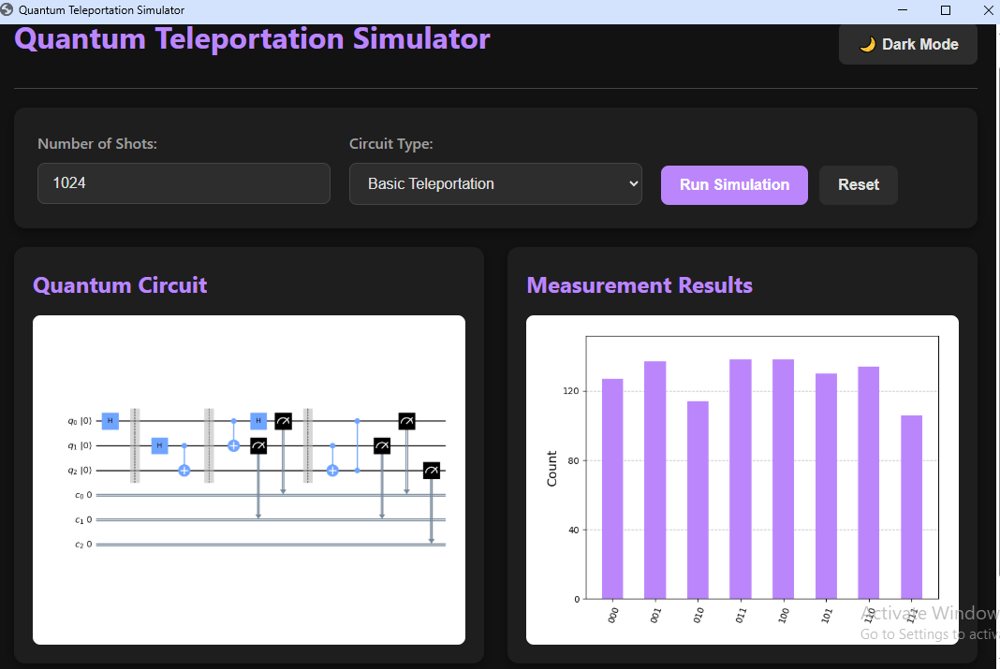
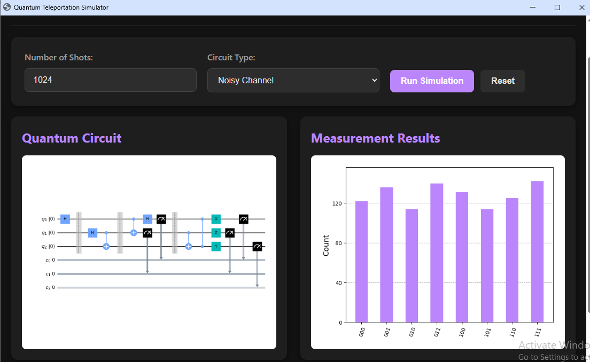
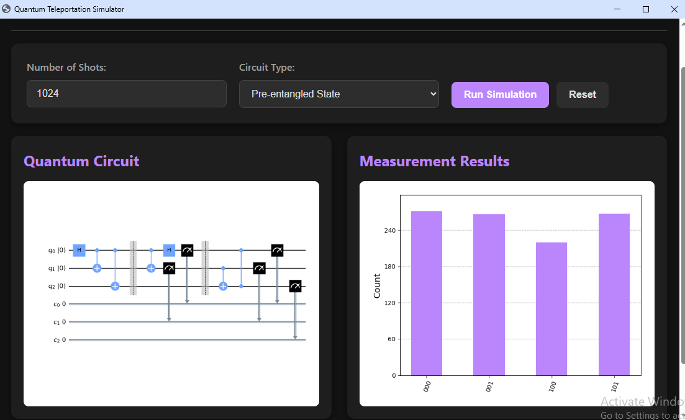

# 🌌 Quantum Teleportation GUI
Python GUI for quantum teleportation simulation using Qiskit and Eel


[](https://python.org)
[](https://qiskit.org)
[](https://github.com/python-eel/Eel)
[](LICENSE)

A Python GUI for simulating quantum teleportation circuits with real-time visualization.
## DEMO



## ✨ Features

- **Interactive quantum circuit simulation**
  - Teleportation protocol implementation
  - Multiple circuit types (Basic/Noisy/Entangled)
- **Professional visualization**
  - Live circuit diagrams
  - Measurement histograms
- **Modern GUI**
  - Dark/light mode toggle
  - Responsive design
- **Error handling**
  - Quantum simulation validation
  - User input sanitization

## 🛠️ Installation
```bash
pip install -r requirements.txt  
python main.py


## 🎮 Usage
Select circuit type from dropdown

Enter number of shots (e.g., 1024)

Click "Run Simulation"

View results:

Left panel: Quantum circuit diagram

Right panel: Measurement histogram


## 🌌 Quantum Basics  
This implements the 3-step teleportation protocol:  
1. **Entanglement** - Creates Bell pair between qubits  
2. **Measurement** - Bell state measurement  
3. **Correction** - Applies X/Z gates based on results  